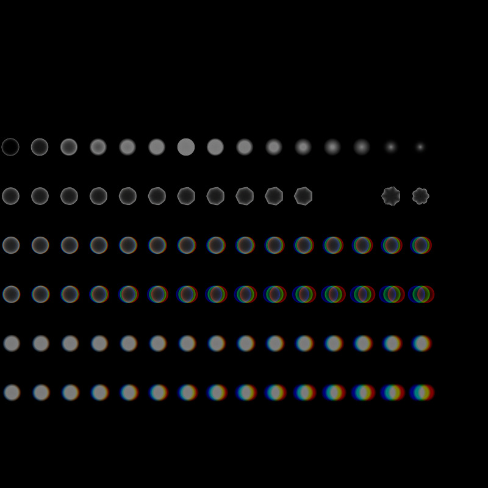
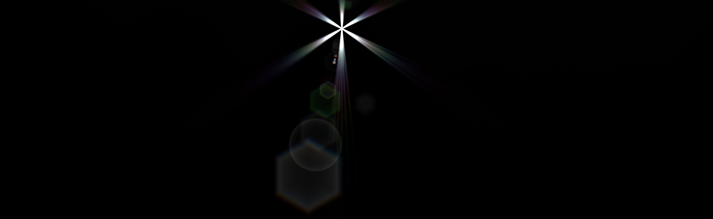
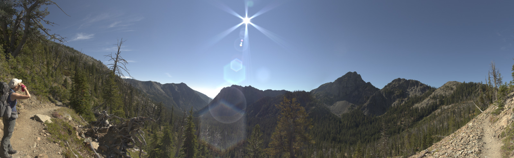

# Lens Flare
Lensflare is a small utility added as an option to skyfill generate lens flare artifacts caused by the sun or other bright lights refracting/reflecting through camera lenses.

It is not an attempt to create a true physical model of how flares are created in a lens, it is just a simple way to generate some flare and aperture ghosts  that is good enough to have a pleasantly realistic rendering

Lensflare reads data from an external command file, and applies the results to a current image buffer that is open in skyfill.

## Units

- x,y positions on the image are proportions. 0,0 is upper left, 1,1 is lower right
- angles are in degrees
- CA (chromatic aberration) is pixels, per 1000 pixels distance from the sun center
- ray length radius, and ghost radius are pixels

## Datafile Format
The data file is a simple text file, with a small set of "commands",
The commands are briefly

- FILE - insert lines from an additional file
- BLACKSKY -set background image to black for testing
- LEAVES -set number of leaves on camera aperture
- FLARE -set ray types, from simple to more complicated
- SCALE -scale the dimensions of rays or ghosts that follow in the data file)
- ROTATE -rotate about the image center the rays or ghosts that follow in the data file)
- IMAGE_CENTER - set the location of the image center to form the flares/ghosts
- GHOST_LINE - create a set of aperture ghosts in a line extending from the image center
- GHOST_RING - create a set of aperture ghoss in a ring around the image center

## Detail of commands

**FILE < filename > -- insert lines from "filename" in current processing sequence**

**BLACKSKY -- sets entire background to black -- useful for designing new flares**

**LEAVES < N > -- sets the number of leaves on the aperture to N**

**FLARE < type radius reverse_radius [D_per_angle E_per_angle] >**

- *type* defines the flare type, 1 is simple ray, 3 gives a set of parallel rays for every leaf.
- *radius* is length of ray in pixels
- *reverse_radius* sets how long to make a the ray starting at 180 degrees from the main ray, this is a proportion which will be applied to *radius*


** (note, SCALE and ROTATE commands will overwrite previous SCALE and ROTATE values) **

**SCALE < a_h s_s s_v s_radius s_dist >**
>FOR ALL ELEMENTS (rays & ghosts) that follow in the data file:

- *a_h* is added to the hue
- element saturation is muliplied by *s_s*
- element value is multiplied by *s_v*
- element radius is multiplied by *s_radius*
- element distance is multiplied by *s_dist*


**ROTATE < D > -- rotate following elements by *D* degrees**

**IMAGE_CENTER < x y > defines the true center of the image to be x y. Units are a proportion, (default is imagewidth/2, imageheight/2)**

**SUN_CENTER < x y > defines the location of the sun (generating the rays) to be x y. Units are a proportion, (default is imagewidth/2, imageheight/2)** 

__*The location of the sun relative to the image center changes the rendering of aperture ghosts, the farther the distance between sun and image center, the more the ghosts will spread apart along the radial line from the sun center*__

**MOVE_CENTER < dx dy > move both IMAGE_CENTER and SUN_CENTER by dx, dy, units are proportions**

**GHOST_LINE < angle CA > -- creates a series of ghost-like images in a line at *angle* degrees from the center, *CA* is amount of chromatic aberration applied to the ghosts**

> additional lines that follow GHOST_LINE:

 < dist radius H S V p_poly fill >

-*dist* is the ghost distance from image center in proportion
-*radius* is the radius of the ghost in pixels
- *H,S,V*  are hue,saturation and value components of ghost color
- *p_poly* defines the shape of the ghosts, 0 to 1, 0 is circle, 1 is polygon with number of aperture leaves
- *fill*  how to fill the color, 0 is a ring, 1 a disk, 4 a more gaussian like fill.  *fill* is a real number from 0 to 4

**GHOST_RING < n dist radius CA > -- creates a series of ghost-like images in a ring  at distance *dist* pixels  with radius *radius* pixels, *CA* is amount of chromatic aberration applied to the ghosts**

> additional lines that follow GHOST_LINE:

 < angle R G B p_poly fill >

-*angle* is the angle in degrees for the ghost from image center
- *H,S,V*  are hue,saturation and value components of ghost color
- *p_poly* defines the shape of the ghosts, 0 to 1, 0 is circle, 1 is polygon with number of aperture leaves
- *fill*  how to fill the color, 0 is a ring, 1 a disk, 4 a more gaussian like fill.  *fill* is a real number from 0 to 4

## Examples of flares and ghosts primitives


- Upper left is flare type 1, with 7 leaves and a back radius proportion of 0.5
- Upper right is the same thing but flare type 2
- Lower left is flare type 1, with 7 leaves and back radius proportion of 0.0
- Lower right is the same thing but flare type 2



Aperture ghost samples:

- Row 1 -- circle shape with fill parameters (0,.167,.33,.5,.667,.84,1.0,1.67,1.33,1.5,1.667,1.84,2.0,3.0,4.0)
- Row 2 -- Fill parameter 0.2, p_poly parameters (0,.1,.2,.3,.4,.5,.6,.7,.8,.9,1.,3.25,-2.00)
- Row 3 -- fill parameter .25, circles, chromatic aberration set to 5
- Row 4 -- fill parameter .25, circles, chromatic aberration set to 10
- Row 5 -- fill parameter 1.25, circles, chromatic aberration set to 5
- Row 6 -- fill parameter 1.25, circles, chromatic aberration set to 10

## Complete example of a lens flare and ghosts on plain background


## Complete example on skyfill result



Command file used to create complete example:
```
IMAGE_CENTER .45 .55
LEAVES 6

FLARE 2 850 .5

SCALE 0 1 1.00 1.75 0.8

GHOST_LINE -30 10
.52 27   0 0.00 0.05 .52 1.5

GHOST_LINE 0 10
-.259 26   0 0.00 0.03 .259 1.5
-.228 35   0 0.00 0.03 .228 1.5
-.160 13 120 0.50 0.10 .160 1.5
.103 15   0 0.00 0.05 .103 .5
.133 15   0 0.00 0.05 .133 .5
.185 04   0 0.50 0.40 .190 .6
.210 03   0 0.00 0.50 .201 .6
.229 04   0 0.00 0.50 1.00 .6
.224 23   0 0.00 0.03 .224 .22
.371 23   0 0.67 0.03 .371 .5
.417 19   0 0.00 0.10 1 0.25
.492 37 120 0.67 0.09 1 0.35
.691 44   0 0.00 0.05 1 0.35
1.00 78   0 0.00 0.12 1 0.35

GHOST_LINE 0 1
.790 61   0 0.00 0.08 0 .1

GHOST_RING 100 20 10
60   0 0.00 0.03 1 1.5
90   0 0.00 0.03 1 1.5
120   0 0.00 0.03 1 1.5
```
