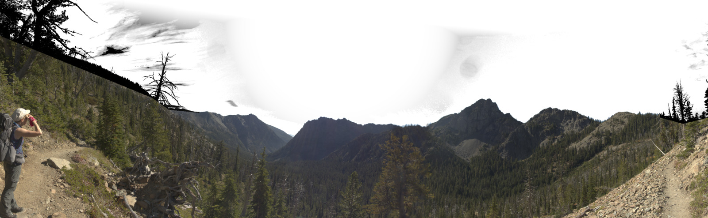
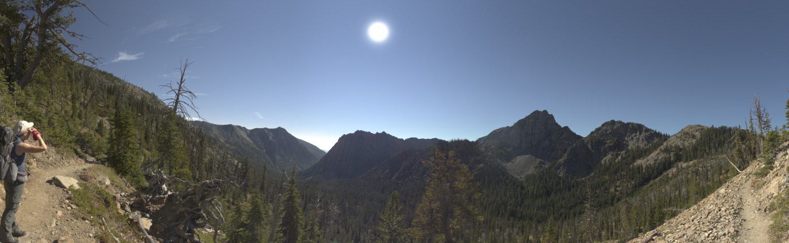
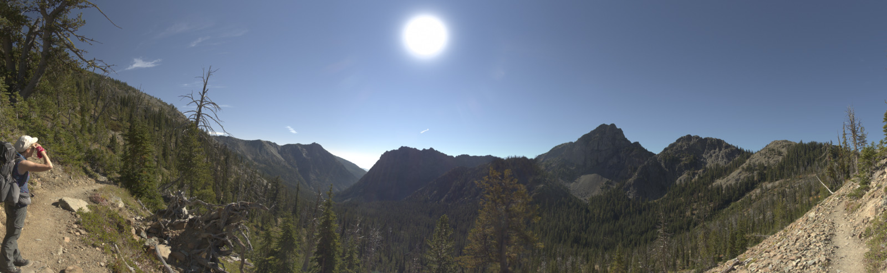
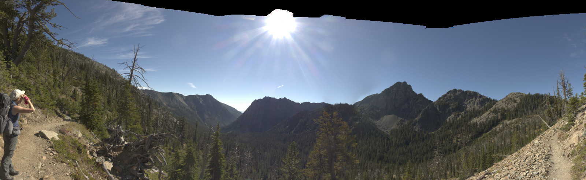

Sunday, 20. March 2022 4:41PM 

# A Sky Fill tutorial - part 3, Sun Model
At the end of [Part 2](SkyFill_tutorial_fsr.md) of this tutorial, we were working with this image:

 

Now we would like to clean up the area around the sun.  SkyFill has a basic sun model, the parameters are:

* Sun Position
  "-sx \<d\> \<r\>"  -- sets the sun x postion to d, *d* is degrees (+/-) from the center of the image
  "-sy \<py\> \<r\>"  -- sets the sun y postion to *py*, *py* is 0.0 at image bottom, 1.0 at top of image. *py* may be > 1.0
* Sun Diameter
  "-D \<value\> \<r\>"  -- sets the sun diameter, size is approximately *value* degrees (relative to horizontal FOV), default 1.0
* Sun intensity relative to background
  "-C \<value\> \<r\>"  -- sets the sun model brightness, reasonable range 0. to 10.  default 2.0
* Alpha of the sun model
  "-F \<value\> \<r\>"  -- sets the alpha (transparency) of the sun model
* Range/falloff of sun model in sky
  "-G \<value\> \<r\>"  -- sets the range and falloff to override pixel values with sun or sky model.  Units are proportion of image width

An important note about the "size" of the sun in photos.  The physical reality is the sun is much smaller than what you might first think is the sun diameter.  The reason for this is much of the area around the actual sun is blown out, which artificially increases the diameter of the percieved sun in the image.  The model used here in no way attempts to be physically accurate, but attempts to make a sun image that mimics what the camera would have recorded.

Here are the values I have found that work well for this image
"-C 6.5 -D 1.0 -F 1.0 -G 0.12 -sx -2.45 -sy .87"

Which means, make the sun model very bright (-C 6.5), with diamter of 1 (-D 1.0).  Set the sun alpha to 1 (-F 1.0), and the range to 0.12 (-G 0.12).  ~put the sun 2.45 degrees left of the center, at 87% of the height.

First let's look at how the (-G 0.12) has altered the probability of sky.  So we'll use the sun parameters plus the -SSP flag

 

The -G flag works like this.  With a G set to 0.12, any pixel that is within a distance of 0.12 (proportion!), of the sun center is completely over ridden with the sky+sun model.  The distance values from 0.12 to 0.24 are ramped to 0.0, and the replacement probability is the maximum of the value determined by this distance model and the probabilty without the sun model override.

Here is the image without the "-SSP" flag:

For an example, here is what is produce when the sun diameter is doubled but the range is halved (-D 2.0 -G 0.06)

The sun is about double in size, but since the range is reduced a little bit of the outer lens flare is showing up.

Finishing up this tutorial, here is the original image

Let's adjust the point at which pixels are transformed from sky actual values to modeled sky.  The flag is -fsrt, and the defaults
are 0.9 200, which means when the probability function is 0.9 that the pixel is a sky pixel, blend it at 50% with the modeled value and 50% with the original value.  The ramp value of 200 is very steep.  By changing the midpoint from 0.9 to 0.95, and giving it a gentler ramp of 10, let's see what happens with the clouds on the left side.

And our final image:

A small amout of editing in photoshop or darktable for the cloud and this will be a nice momento of a nice backpack, and I didn't have to haul along a tripod either!

