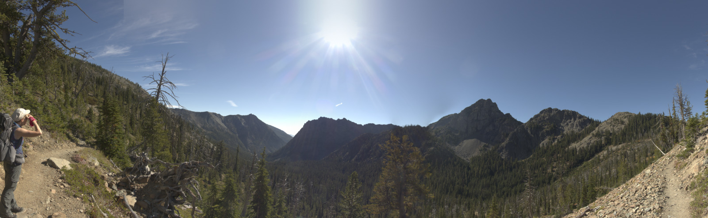
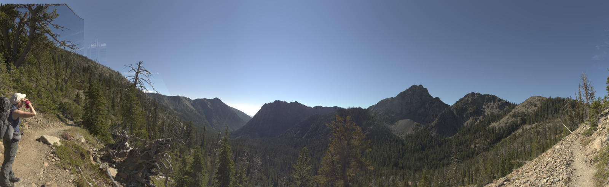
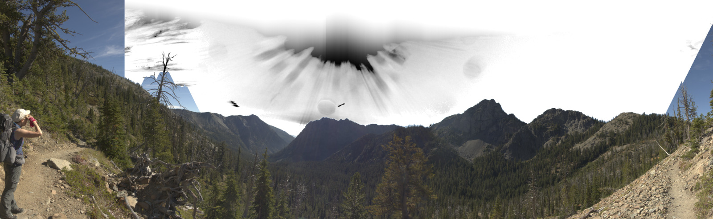
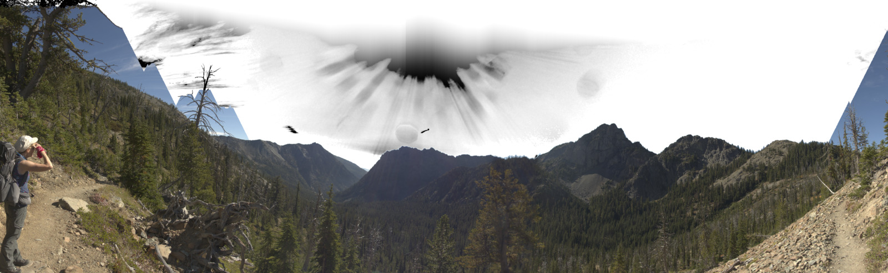
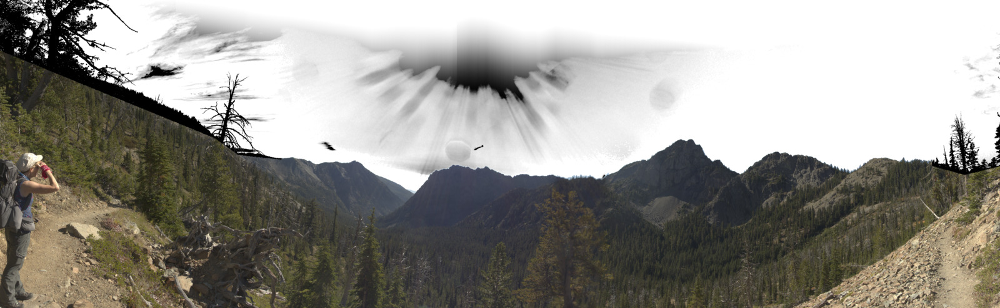
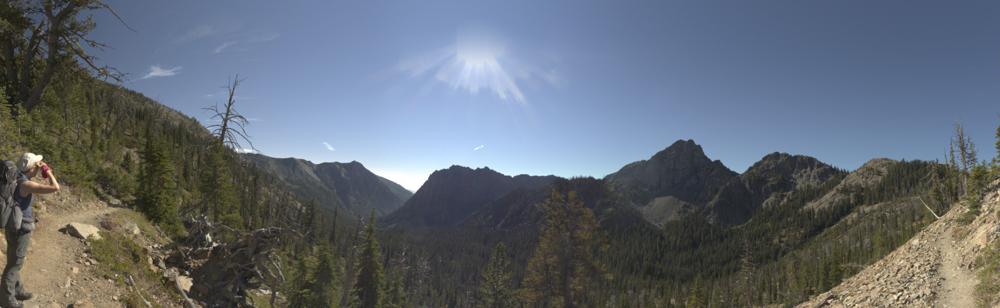

Sunday, 20. March 2022 08:41AM 

# A Sky Fill tutorial - part 2, Full Sky Replacement Mode
At the end of [Part 1](SkyFill_tutorial_v1.md) of this tutorial, we were working with this image:

It is clear the image is not yet usable and would need a lot of post-processing to clean it up.

**Full Sky Replacement Mode** was developed.  It attempts to recognize pixels that are truly "clear sky", and replace or extend those, and leave other pixels as they are found.

First let's get an understanding of the "sky model" SkyFill has created to estimate the sky HSV in the areas of the image which have been identified as sky.   Run sky_fill with the "-EO" flag to produce this image:

The detected end of sky runs down to the horizon except on the two trees and clouds on the left, and an area on the right edge.

Next, let's add the -fsr flag to turn on full sky replacement, and the -SSP flag, which will color the sky in grayscale, where black implies the pixel is not considered a sky pixel, and white implies the pixel is a sky pixel, keeping all our original masking flags:

 

The left side of the image was completely masked off, so the "-m 0 490" mask needs to be removed, but we don't want sky color samples to occur in that area so we change the "-m 0 490" to "-sm 0 490"
 
The next problem to handle is sky detection can't see "through" large objects in they sky like the tree branches, or thick clouds.  To handle this, a separate text file must be created, with the same filename prefix as the image, but the suffix is ".eos"  (end of sky file).  In this file we'll put line segments that override the end of sky detection and cause SkyFill to consider any pixels from the top of the image down to the line segments as possible sky (or not).   Here is the .eos file for this image:

>X Y
>
>0 142
>
> 604 389
> 
> 669 436
> 
> 790 449
> 
> -1 -1
> 
> 2619 467
> 
> 2710 492
> 
> 2809 468

The first line of the file is "X Y", and next lines are X,Y pairs that will be connected with line segments.  The "-1 -1" line breaks a current contiguous set of line segments, the "2619 467" line starts a new contiguous set of line segments.   The first line MUST be "X Y", and subsequent lines MUST have a space between the X and Y values.  Here is what the previous image showing sky probabilities looks like now:
 

SkyFill has classified the trees and foliage well (black), and clouds seem to be part sky, the original area of blown out sky due to the sun and lens flare is also not predicted to be 100% sky.   Here is what the image looks like if we remove the -SSP flag
 

A couple of things are notably better in this image than where we started
- The vertical edge at the left side of the image where there was a mask has been eliminated
- The clouds on the left side have not been "smeared" into the top of the image -- though most of the clouds have been reduced in intensity and the one larger one near the horizon looks artificial and will need some post processing
- At the horizon, just right of center, the dark smear in the sky has been eliminated.

The sun still isn't acceptable, and in the next part of this series we'll cover how to use the sun model in [Part 3](SkyFill_tutorial_Sun_Model.md) of the tutorial.
