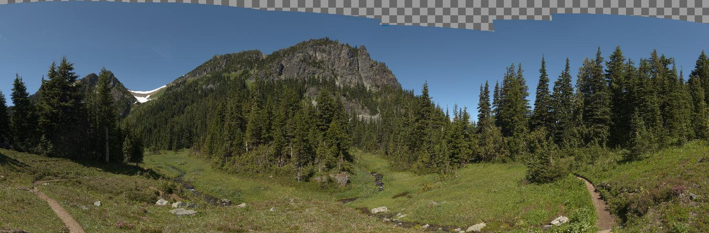
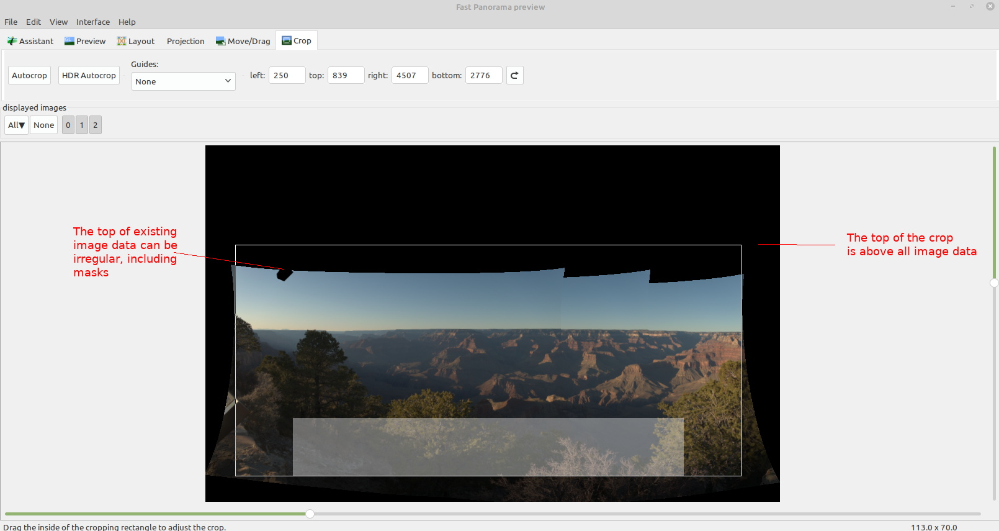
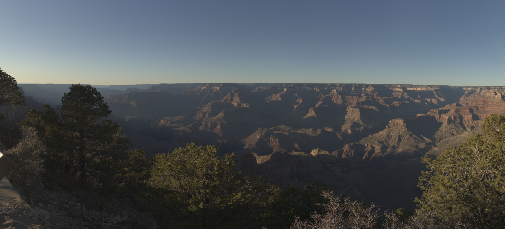
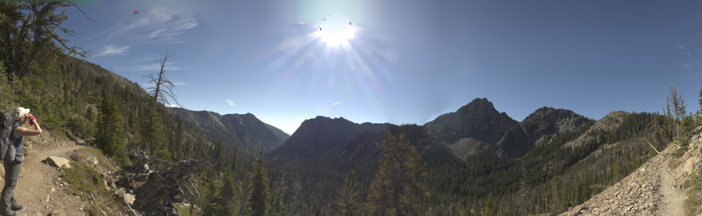
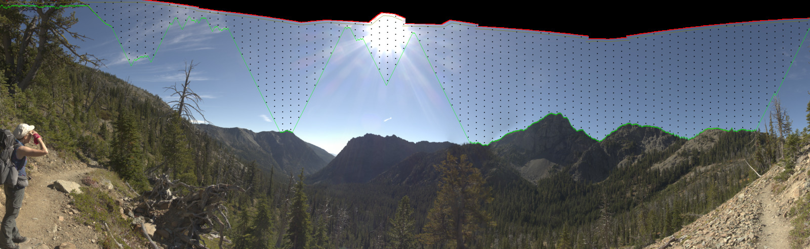
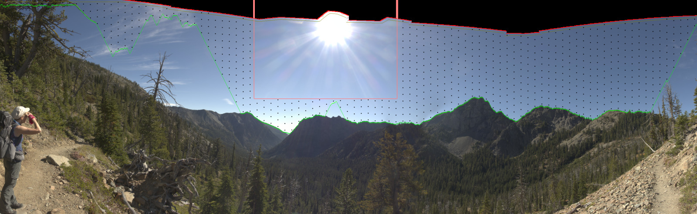

Monday, 21. February 2022 08:41AM 

# A Sky Fill tutorial
Do you have a  [stitched](http://hugin.sourceforge.net/) panorama that doesn't have as much blue sky at the top as you want? 

[SkyFill](https://github.com/weltyj/SkyFill) is an application designed to fill the top of clear blue skies and give you the image you wish you had.

Sky fill is designed to work with 8 or 16 bit tiff images, with 4 channels (Red,Green,Blue and Alpha) -- the kind of images that hugin creates.

Let's get started.

***

First create your panorama in hugin -- but when you set the crop area, now extend the top border of the crop right into the black area -- as high as you'd like the sky to be extended:

*Note -- Multiblend does not honor crops that extend above image data, you will have to use enblend*

***

Sky fill is a commandline application, so you will need to open a command window (aka terminal in linux, "dos window" in linux, ?? in Apple)

You will need to know the location of two things to run skyfill:
1.  The complete path to the skyfill application (if it's not in your path), for this tutorial we'll call it /skyfill\_loc/skyfill\_tif
2.  The location of your image.  For this example we'll call it /images/hugin_crop.tif

Now you change to the location of your image, and run skyfill:

	cd /images
	/skyfill_loc/skyfill_tif hugin_crop.tif hugin_cropsf.tif

If your image is is relatively simple, like this one, with plenty of existing sky, a relatively simple horizon, and no clouds or jet trails in the sky, skyfill should have little trouble getting a good model of how the sky hue, saturation and values changes vertically from the horizon, and horizonally (left-right) across the sky, and will fill the sky.

At this point, you can import the filled sky image into your favorite image editor and continue working with your image.

***

Now, let's look at a more complex sky (note -- black area at the top of the image is alpha=0.)

Let's see what happens if we run skyfill on this image:

That is not an acceptable result.  Rerun skyfill, but add the "-d3" flag to start diagnosing what skyfill is doing: 

This is the original image, with some marks added by skyfill.  The red line at the top of the image represents the original top of image data found.  The brown line immediately below it is where the end of sky detection "turns on".  Most importantly, the green line marks the end of the sky, and the little black dots represent a sample point for modelling the sky HSV.  The first, most obvious problem is that the sun and lens flare, and clouds have given a bad prediction of where the true end of sky is at.  This can be handled with a "test mask"

First, mask out the sun and lens flare using the "-tm <left> <right> <top> <bottom>" option, and rerun skyfill still using the -d3 option:

This image shows the rectangular test mask in light red.  That is better -- the sun and lens flare has not interferred with the end of sky detection, and is not being used as estimates of the real blue sky.  Now mask off all the other clouds and jet trails with more test masks, as well as masking the left side of the image "-m <left> <right>" where the tree is at:

Note that the end of sky and start of sky marks have disappeared on the left side where the "-m" mask masked off the entire section of the image.

Using this masking strategy -- here is what the skyfilled image looks like:

It looks marginally better around the sun, but there are some bad rectangles with strange colors that have appeared around the sun, as well as in the clouds on the left side.   These are caused by the sky modelling and blending algorithm detecting what appear to be incorrect colors in the original sky image.  With lens flare and sky, this approach can get very "confused" and produce these artifacts.  This is the reason for the "-rm <left> <right>" mask -- it disables sky repair of original image.  This is the result after addition of the "-rm" mask:

This is much better, and perhaps may be good enough to move ahead with additional editing.  The reason the area above the sun stays bright to the top of the image is because the blending model is attempting to make a smooth transition between the modelled sky and the actual image so it will brighten the modelled sky to match the sun.  A similar problem is on the left side of the image with the clouds at the top of the sky.

The is why **Full Sky Replacement Mode** was developed.  It attempts to recognize pixels that are truly "clear sky", and replace or extend those, and leave other pixels as they are found.

***More to come***
